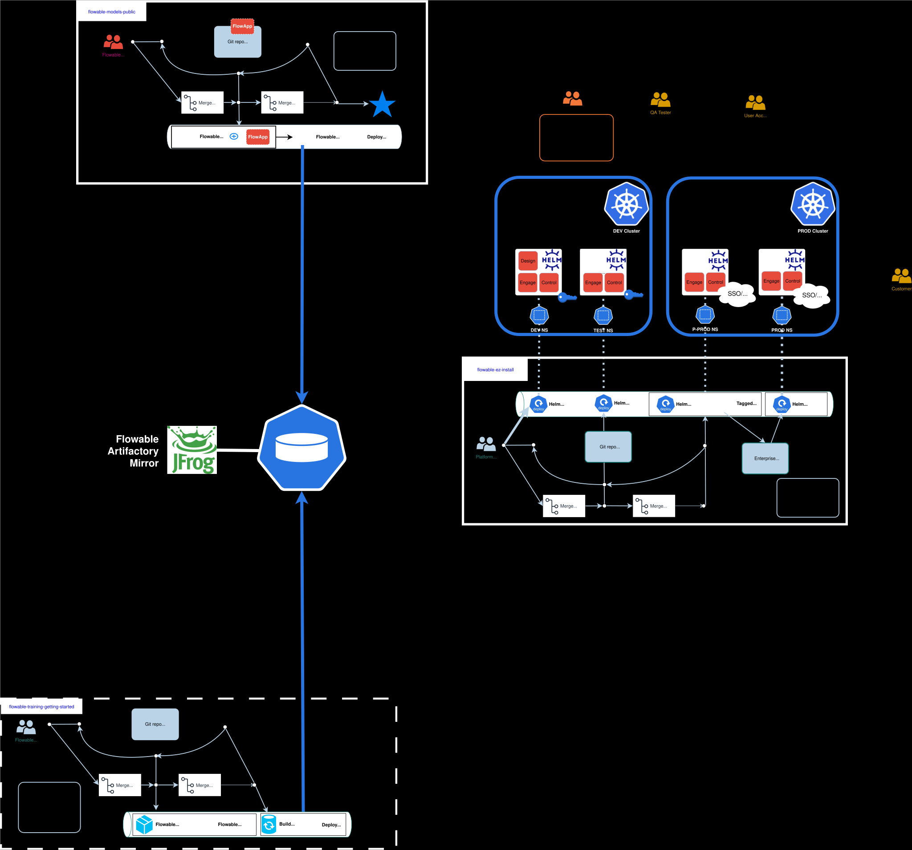
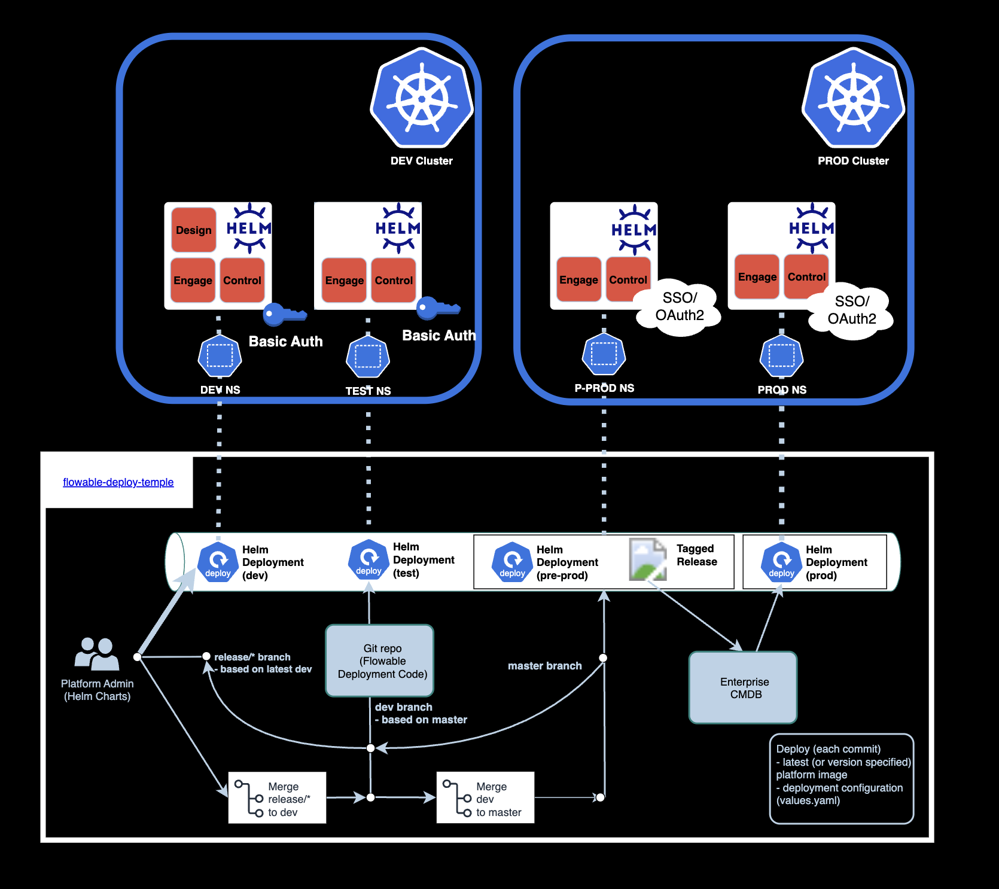
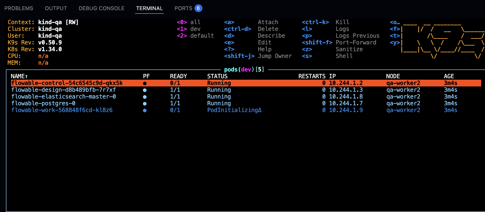
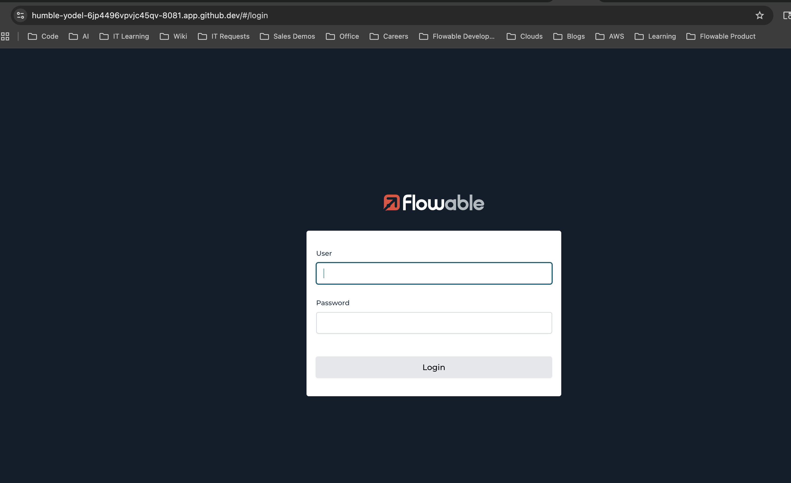
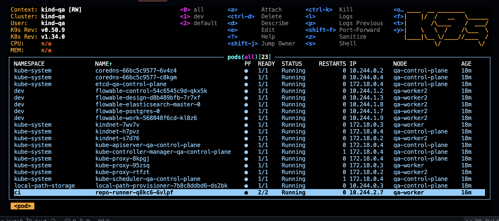

# flowable-deploy-template-local

This repository is #2 of 3 that is meant to serve as a "Best Practice Example" when it comes to Flowable DevOps. Below is the architecture and prescribed Git Branching strategy for the 3 repositories:



# Introduction

Zooming into the second portion of the diagram, we can focus on the purpose of this repository: Flowable deployments via Helm.



This is a **local-hardware variant** of the original `flowable-deploy-template`: instead of two separate 3-node `kind` clusters running inside a GitHub Codespace (heavy enough to strain a Codespaces VM), everything here runs on one single-node `kind` cluster on your own machine (via Docker Desktop or any Docker engine `kind` supports). That one node hosts all three demo environments as namespaces (`dev`, `test`, `stg`), with a single shared Traefik install instead of two duplicated ones.

## Prerequisites

- Docker (e.g. [Docker Desktop](https://www.docker.com/products/docker-desktop/)) and `kind` (`brew install kind` on macOS).
- `helm`, `kubectl`, `yq` (`brew install helm kubectl yq` on macOS).
- A Flowable Artifactory account (`FLOWABLE_REPO_USER` / `FLOWABLE_REPO_PASSWORD`) and a Flowable license file, needed to pull the Flowable Helm chart and images.
- Optional: [k9s](https://k9scli.io/) for browsing pods/logs (`brew install derailed/k9s/k9s`).

## Getting started

### Create Env

1) Clone this repo (with submodules) and enter it:
```
git clone --recurse-submodules <your-fork-url> flowable-deploy-template-local
cd flowable-deploy-template-local
```

2) Set the required environment variables in your shell (or let `create-env.sh` prompt you for them interactively the first time):
```
export FLOWABLE_REPO_USER=<your-flowable-artifactory-email>
export FLOWABLE_REPO_PASSWORD=<your-flowable-artifactory-password>
export FLOWABLE_LICENSE_KEY="$(cat /path/to/flowable.license)"
```

3) Run the create-env script:
```
./create-env.sh --all
```
This starts the shared Postgres + Elasticsearch + Keycloak + OpenLDAP containers via `docker-compose`, creates a single-node `kind` cluster named `local` (plus a local image registry and Traefik), and deploys Flowable into the `dev`, `test` and `stg` namespaces (dev: Work + Design + Control, test: Work + Control, stg: Work + Control with Keycloak login). It takes a few minutes for everything to come up.

4) Observe with `k9s` (optional):
```
k9s
```
Since there's only one cluster now, `k9s` opens straight into the `kind-local` context (no cluster-picker step needed). Switch namespaces with `:ns` to watch `dev`/`test`/`stg` come up to `STATUS=Running`.



### Access the deployment

The kind cluster's control-plane node maps host ports 80/443 straight through to the Traefik pod (via `kind-cluster-setup.sh`'s `extraPortMappings`), so `localhost` reaches it directly - no port-forwarding step needed:

- **dev**: [http://localhost/dev/work/](http://localhost/dev/work/), [http://localhost/dev/design/](http://localhost/dev/design/), [http://localhost/dev/control/](http://localhost/dev/control/)
- **test**: [http://localhost/test/work/](http://localhost/test/work/), [http://localhost/test/control/](http://localhost/test/control/)
- **stg**: [http://localhost/stg/work/](http://localhost/stg/work/), [http://localhost/stg/control/](http://localhost/stg/control/) (Keycloak login - see below)

You should be greeted with a Flowable login page:



Use `admin`/`test` for `dev` and `test`. `stg` uses OAuth2 login via a local Keycloak instance instead of basic auth.

### stg's Keycloak/LDAP login

`stg` demonstrates OAuth2 login against a self-contained local identity stack - no external accounts or app registration needed, unlike the original Codespaces demo's GitHub OAuth App:

- **OpenLDAP** (`docker/ldap/`) holds two demo users: `admin`/`admin` (member of the `flowableAdministrator` and `flowableUser` groups) and `user`/`user` (member of `flowableUser` only).
- **Keycloak** (`docker/keycloak/flowable-realm.json`, imported automatically) federates those LDAP users/groups into a `flowable` realm, with `flowable-work` and `flowable-control` as separate OIDC clients. Its admin console is at [http://localhost:9095/](http://localhost:9095/) (`admin`/`admin`).
- Log in at `http://localhost/stg/work/` with `admin`/`admin` for full (`flowableAdministrator`) access, or `user`/`user` for a regular member.
- Browse the LDAP directory at [http://localhost:9096/](http://localhost:9096/) (phpLDAPadmin) if you want to add/inspect users - bind DN `cn=admin,dc=flowable,dc=local`, password `admin`.

The client secrets in `helm/templates/oauth2-configmap.yaml` are fixed local-demo values matching the realm import - they never leave `localhost`, so there's nothing to configure before running `create-env.sh`.

### Optional: the CI/CD self-hosted-runner demo

The original Codespaces setup always installed `actions-runner-controller` (ARC) + `cert-manager` so a push to this repo would trigger an in-cluster Helm deploy via [.github/workflows/deploy-dev-qa.yml](.github/workflows/deploy-dev-qa.yml). Locally this is **opt-in**, since it adds real overhead (cert-manager + ARC controller + a runner pod) just to demo something a plain `./create-env.sh` already does:

```
DISABLE_ARC=false ./create-env.sh --all
```

You'll be prompted for a GitHub PAT (`ARC_TOKEN`) with permission to register a self-hosted runner. It registers against `abretz-mimacom/flowable-models-deploy` by default - export `GITHUB_REPOSITORY=<owner>/<repo>` first to target a different one. Verify it came up with `kubectl -n ci get pods` - you should see a `repo-runner-*` pod, and its logs should end with something like:
```
√ Connected to GitHub
Current runner version: '2.328.0'
Listening for Jobs
```



### Tearing down

```
./delete-env.sh
```
This deletes the `local` kind cluster entirely and stops the shared Postgres/Elasticsearch containers.
